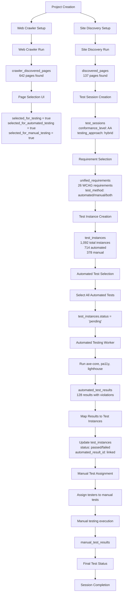

# Detailed Data Flow: Session Creation to Test Completion

## Current Process Flow



## Critical Issues in Current Flow

### 1. **Page Selection Gap** 🔴 CRITICAL

```
crawler_discovered_pages (642 pages)
    ↓
Page Selection UI
    ↓
selected_for_testing = false (most pages)
    ↓
discovered_pages (137 pages) ← Only these pages get test instances
```

**Problem**: 505 pages (642 - 137) are crawled but not selected for testing.

### 2. **Test Method Mapping Issue** 🔴 CRITICAL

```
unified_requirements
    ↓
test_method: 'both' (11 requirements)
    ↓
test_instances creation
    ↓
test_method_used: 'automated' only ← SHOULD BE BOTH
```

**Problem**: Requirements that need both automated AND manual testing only get automated test instances.

### 3. **Requirement Applicability** 🟡 MEDIUM

```
discovered_pages (137 pages)
    ↓
All requirements applied to all pages
    ↓
test_instances (1,092 = 137 × 26)
```

**Problem**: Every page gets every requirement, regardless of page type or requirement applicability.

## Corrected Data Flow

```mermaid
graph TD
    A[Project Creation] --> B[Web Crawler Setup]
    A --> C[Site Discovery Setup]
    
    B --> D[Web Crawler Run]
    C --> E[Site Discovery Run]
    
    D --> F[crawler_discovered_pages<br/>642 pages found]
    E --> G[discovered_pages<br/>137 pages found]
    
    F --> H[Page Selection UI]
    H --> I[selected_for_testing = true<br/>selected_for_automated_testing = true<br/>selected_for_manual_testing = true]
    
    I --> J[Sync to discovered_pages]
    J --> K[discovered_pages updated<br/>Include selected crawler pages]
    
    K --> L[Test Session Creation]
    L --> M[test_sessions<br/>conformance_level: AA<br/>testing_approach: hybrid]
    
    M --> N[Smart Requirement Assignment]
    N --> O[Match page_type with applies_to_page_types]
    O --> P[Create test instances only for applicable requirements]
    
    P --> Q[test_instances creation]
    Q --> R[For 'both' requirements: create 2 instances<br/>1 automated + 1 manual]
    R --> S[For 'automated' requirements: create 1 automated instance]
    S --> T[For 'manual' requirements: create 1 manual instance]
    
    T --> U[Automated Test Selection]
    U --> V[Select All Automated Tests]
    V --> W[test_instances.status = 'pending'<br/>for automated instances only]
    
    W --> X[Automated Testing Worker]
    X --> Y[Run axe-core, pa11y, lighthouse]
    Y --> Z[automated_test_results<br/>Results with violations]
    
    Z --> AA[Map Results to Test Instances]
    AA --> BB[Update test_instances<br/>status: passed/failed<br/>automated_result_id: linked]
    
    BB --> CC[Manual Test Assignment]
    CC --> DD[Assign testers to manual instances]
    DD --> EE[Manual testing execution]
    EE --> FF[manual_test_results]
    
    FF --> GG[Final Test Status]
    GG --> HH[Session Completion]
```



## Required Database Changes

### 1. **Fix Test Instance Creation Logic**

```sql
-- Current logic (INCORRECT)
INSERT INTO test_instances (session_id, requirement_id, page_id, test_method_used)
SELECT 
    'session_id',
    ur.id,
    dp.id,
    ur.test_method  -- This creates 'both' as test_method_used
FROM unified_requirements ur
CROSS JOIN discovered_pages dp;

-- Corrected logic
INSERT INTO test_instances (session_id, requirement_id, page_id, test_method_used)
SELECT 
    'session_id',
    ur.id,
    dp.id,
    'automated'
FROM unified_requirements ur
CROSS JOIN discovered_pages dp
WHERE ur.test_method IN ('automated', 'both')

UNION ALL

SELECT 
    'session_id',
    ur.id,
    dp.id,
    'manual'
FROM unified_requirements ur
CROSS JOIN discovered_pages dp
WHERE ur.test_method IN ('manual', 'both');
```

### 2. **Synchronize Page Selection**

```sql
-- Create missing discovered_pages for selected crawler pages
INSERT INTO discovered_pages (discovery_id, url, title, page_type, http_status)
SELECT 
    (SELECT id FROM site_discovery WHERE project_id = '73e05c7d-6f2c-4c0c-b385-3030224c0de4' LIMIT 1),
    cdp.url,
    cdp.title,
    COALESCE(cdp.page_type, 'content'),
    cdp.status_code
FROM crawler_discovered_pages cdp
WHERE cdp.selected_for_testing = true
AND NOT EXISTS (
    SELECT 1 FROM discovered_pages dp WHERE dp.url = cdp.url
);
```

### 3. **Smart Requirement Assignment**

```sql
-- Only create test instances for applicable requirements
INSERT INTO test_instances (session_id, requirement_id, page_id, test_method_used)
SELECT 
    'session_id',
    ur.id,
    dp.id,
    'automated'
FROM unified_requirements ur
CROSS JOIN discovered_pages dp
WHERE ur.test_method IN ('automated', 'both')
AND (
    ur.applies_to_page_types @> ARRAY[dp.page_type] 
    OR ur.applies_to_page_types @> ARRAY['all']
);
```

## Expected Results After Fixes

### Current State (INCORRECT)
- **Test Instances**: 1,092 (137 pages × 26 requirements)
- **Automated**: 714
- **Manual**: 378
- **Missing**: Hybrid tests for 'both' requirements

### Corrected State
- **Test Instances**: ~1,500+ (depending on page selection)
- **Automated**: ~800+ (including hybrid requirements)
- **Manual**: ~700+ (including hybrid requirements)
- **Complete**: All requirements properly mapped

## Implementation Priority

1. **🔴 IMMEDIATE**: Fix test method mapping for 'both' requirements
2. **🔴 HIGH**: Synchronize page selection between crawler and discovery
3. **🟡 MEDIUM**: Implement smart requirement assignment
4. **🟢 LOW**: Add data validation constraints 